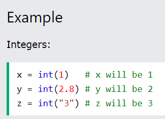
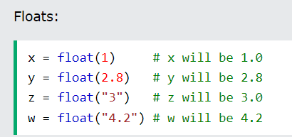
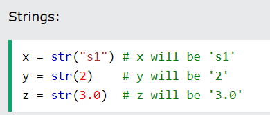
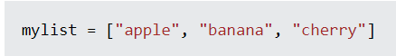
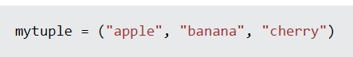
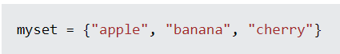

# Python Tools

## Python Data Types

--- 
| Text Type:      | str                  | string       |
| :---            | :---                 | :---         |
| Boolean Type:   |  bool                | True or False         |
| Numeric Type:   |  int, float, complex | numbers      |
| Binary Types:   | bytes, bytearray, memoryview | binary memory         |
| Sequence Types: | list, tuple, range   | ordered data | 
| Mapping Type:   | dict                 | dictionary   |  
|Set Types:       | set, frozenset       | unordered data |
| None Type:      | NoneType             |   

---

**Specifying a variable type can be done by casting**

Casting is done using constructor functions:
- int() : constructs an integer number from an integer literal, a float literal (by removing all decimals), or string literal (providing the string represents a whole number).
- float() : constructs a float number from an integer literal
- str() : constructs a string from a wide variety of data types.

Example of integer casting 

Example of float casting 

Example of string casting 

## Stored Collections of Data

---
| List     | order, changeable, indexed, and allow duplicate values  | created []      |
|:---      | :--- | :--- |
| Tuples   | ordered, unchangeable, indexed, and allow duplicates values | created with ()      |
| Set      | unordered, unchangeable, and unindexed | created with {}     |
| Dictionary | ordered, changeable and do not allow duplicates | store `key:value` pairs     |
---

Example of syntax for a List. 
 

Example of syntax for a Tuple. 
 

Example of syntax for a Set. 
 

Example of syntax for a Dictionary. 
 

