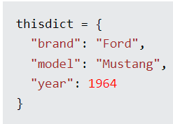

# Python Tools

## Python Data Types

--- 
| Text Type:      | str                  | string       |
| :---            | :---                 | :---         |
| Boolean Type:   |  bool                | True or False         |
| Numeric Type:   |  int, float, complex | numbers      |
| Binary Types:   | bytes, bytearray, memoryview | binary memory         |
| Sequence Types: | list, tuple, range   | ordered data | 
| Mapping Type:   | dict                 | dictionary   |  
|Set Types:       | set, frozenset       | unordered data |
| None Type:      | NoneType             |   

---

**Specifying a variable type can be done by casting**

Casting is done using constructor functions:
- int() : constructs an integer number from an integer literal, a float literal (by removing all decimals), or string literal (providing the string represents a whole number).
- float() : constructs a float number from an integer literal
- str() : constructs a string from a wide variety of data types.

Example of integer casting 

Example of float casting 

Example of string casting 

## Stored Collections of Data

---
| List     | ordered, changeable, indexed, and allow duplicate values  | created with []      |
|:---      | :--- | :--- |
| Tuples   | ordered, unchangeable, indexed, and allow duplicates values | created with ()      |
| Set      | unordered, unchangeable, and unindexed | created with {}     |
| Dictionary | ordered, changeable and do not allow duplicates | store in `key:value` pairs     |
---

Example of syntax for a List. 
 

Example of syntax for a Tuple. 
 

Example of syntax for a Set. 
 

Example of syntax for a Dictionary. 
 

# Python Conditions and If Statements

Logical conditions from mathematics:
- Equals: a == b
- Not Equals: a!= b
- Less than: a < b
- Greater than: a > b
- Greater than or equal to: a >= b

If statements use the if keyword.
 
 

This is the outcome of the if statement example. 
 

The `elif` keyword is pythons way of saying "if the previous conditions were not true, then try this condition".

Example of elif syntax. 
 

The `else` keyword ends the the `if`, `elif`, `else` loop. 

Example of Else syntax. 
 

## Python Loops

Python has two primitive loop commands:
- while loops
- for loops

While loops execute a set of statements as long as the condition is met.

Example of while loop. 
 

**The break Statement**

The `break` statement stops the loop even if the while condition is true.

Use of break statement. 
 

## Python for Loops

A `for` loop is used for iterating over a sequence (that is either a list, a tuple, a dictionary, a set, or a string).

Example of for loop. 
 

The break statement can stop a for loop as well.

