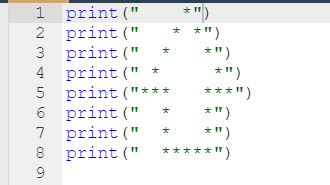
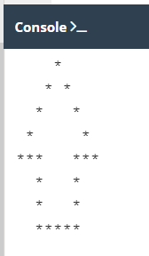
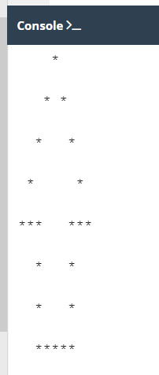
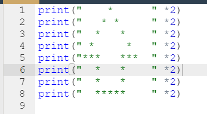
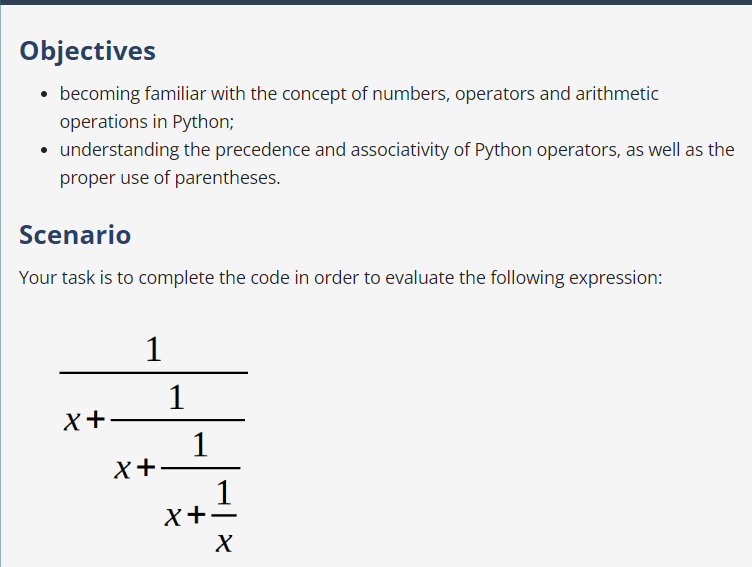

### **Python Institute PCEP Notes**

    (December 2022) - The following notes are from my studies for the PCEP certification exam on the pythoninstituture.org website.  The free study resources are available on Edube Interactive dashboard after creating a profile on edube.org.

<h1>NATURAL LANGUAGE vs. PROGRAMMING LANGUAGE</h1>
 
 

Computers have their own language called <b>machine language.</b> 

 
 

A complete set of known commands is called an <b>instruction list</b> sometimes <b>IL</b>

 
 
<h2>What Makes a Language</h2>

Language consists of the following elements:
<ul><li>Alphabet</li>
<li>lexis</li>
<li>syntax</li>
<li>semantics</li></ul>

 
 

A program written in high0level programming language is called a <b>source code</b>. The file containing the source code is called the <b>source file</b>.

 

There are two different ways of transforming a program from a high-level programming language into machine learning, <b>COMPILATION: </b><ul>The source program is translated once.  This must be repeated each time you modify the source code.</ul><ul>The execution of the translated code is usually faster; 
 Only the user has to have theh compiler - the end-user may use the code without it;
 
The translated code is stored using machine language - it is very hard to understand it.</ul>

 

<b>INTERPRETATION:</b><ul>You can translate the source program each time it has to be run; the probram performing this kind of transformation is called an interpreter, as it interprets the code every time it is inteded to be executed; it also means that you cannot just distribute the source code as-is because the end-user also needs the interpreter to execute it.</ul><ul>you can run the code as soon as you complete it - there are no additional phases or translation;</ul><ul>the code is stored using programming language, not machine language - this means that it can be run on computers using different machine languages, you udon't compile yor code separately for each different architecture.</ul><ul>It's can't be really fast, this is a disadvantage. Also you and the end user have to have the interpreter to run your code.</ul>

 
 
<h2>FUNCTIONS</h2>
 

A function is part of the computer code:
<ul><li><b>cause some effect</b> - send text to the terminal, create a file, draw an image, play a sound, etc.</li><li><b>evaluate a value and return it as the function's result</b>; this is what makes Python functions the relatives of mathematical concepts.</li></ul>

 

What happens when Python encounters a function that needs invocation or to be invoked?<b>function_name(argument)</b> 
<ul><il>First, Python checks if the name specified is <b>legal</b>.</il> <il>Second Python checks if the function's requirements for the number of arguments allows  you to invoke the function in this way</il> <il>Third Python leaves your code for a moment and jumps into the function you want to invoke</il> <il>Fourth the function executes its code</il> <il>Finally, Python returns to your code and resumes its execution.</il><ul>

 

# The print() Function

##  The Positional way of passing the arguments
    - The common way in which passing arguments into the print() function is called the **positional way** .

# The print() function - the keyword arguments

    - Another mechanism for passing of arguments is called **keyword arguments**. 

The print() function has two keyword arguments that you can use for your purposes `end` and `sep`:
    <ul><li>end -   a keyword argument consists of three elements: a keyword (identifying the argument end here ), an equal sign = , and a value assigned to the argument</li><li>any keyword arguments have to be put after the last positional argument.</li></ul>

    - For example: 
        print("My name is", "Python.", end=" ")
        print("Month Python.")
    Console>
        My name is Python. Monty Python.
The default behaviour of the end keyword argument is used in the following way:
     end="\n"

    
**The other print() function keyword is `sep` (like separator)**
 
    - For example,
     `print("My", "name", "is", "Monty", "Python.", sep="-")` 
    **Console>**
         My-name-is-Monty-Python.
    
    The  separator keyword designated the dash - to be the separator between the strings.

Both keyword arguments may be mixed in one invocation.
    
     print("My", "name", "is", sep="_", end="*")
     print("Monty", "Python.", sep="*", end="*\n")

     The console output should look like:

         My_name_is*Monty*Python.*

* **KEYWORD TAKEAWAYS**

1. The `print()` function is a `built-in` function. It prints or outputs a specified message to the screen/console window.

2. Built-in functions, which are not user-defined functions, are always available and don't have to be imported.  Python 3.9 comes with 69 built-in functions, which can be found in alphabetical order in the `Python Standard Library`. 

3. To call a function or invoke a function, you need to use the function name followed by parenthese. You can pass arguments into a function by placing them inside the parentheses. You must separate arguments with a comma,
    `e.g., print("Hello,","World!")`
    An **empty** print() function outputs an empty line or line break to the screen.

4. Python strings are delimited with `quotes`, double quotes or single quotes.  However, whichever type opens the string has to be what is used to close the string. If a string contains quotation marks, single quotes should be used to open and close the complete string.

5. `Positional arguments` are the ones whose meaning is dictated by their position.

6. `Keyword arguments` are the ones whose meaning is not dictated by their location, but by a special work(keyword) used to identify them.

7. The **end** and **sep** paraments can be used for formatting thhe output of the **print()** function.

    `TRY IT:`
         <ul><li>minimize the number of `print()` function invocations by inserting the `\n` sequence into the strings</li>
        
     
      
     
     The print() function has been modified   
    

    
    
    This is the output.    
    
         

        <li>make the arrow twice as large (but keep the proportions</li>
         

     This is a print() function with a `sep` keyword and iterable (*2).   
    
     
    This is the output of the larger arrow. 
    
     

    <li>duplicate the arrow, placing both arrows side by side</li></ul>
     
    Each print()function has been multiplied by 2 and spaces added within each string. 

    
     
    This is the output for the duplicate arrows. 
    

# Literals - The data in itself

`A literal is data whose values are determined by the literal itself.`

    For example: 123 will out put 123

However, if you input c and execute, it will not output c because c is not a literal. There are too many possible definitions or symbols that c can represent, which is why it is not a literal.

## Intergers: octal and hexadecimal numbers

There are two additional conventions in Python that are unknown to the world of mathematics.

<ul><li>The first allows us to us numbers in an <b>octal</b> representation.
  If an integer number is preceded by an <b>0O or 0o</b> (referred to as zero-o), it will be treated as an octal value.  This means that the number must contain digits taken from the [0...7] range only (0-7 is 8 digits, oct' - meaning 8).
 <b<b>0o123</b> is an <b>octal</b> number with a (decimal) value equal to <b>83</b>.

The print() function does the conversion automatically. 
Try:
 <b>print(0o123)</b> The console output should be <b>83</b>
</li>
<li>The second convention allows us to use <b>hexadecimal</b> numbers. Such numbers should be preceded by the prefix <b>0X or 0x</b>(zero-x). 
 <b>0x123</b> is a <b><u>hexadecimal</b></u> number with a (decimal) value equal to <b>291</b>. The print() function converts this automatically as well.  The print() function will look like <b>print(0x123)</b></li></ul>

### **Strings and Quotes**
    Using quotes inside a string can be done by the escape character, which is the backslash, or by using single quotes to open and close the string.
        For example:

        I like "Monty Python".

        print("I like\"Monty Python\."")

        OR

        print('I like "Monty Python".')

   Likewise, if you want to create a print() function that includes an apostrophe, you can use the escape character or open and close with double quotes.
        For example:

        I'm Felicia.

        print("I'm Felicia.")

        OR

        print('I\'m Felicia.')

 Scenario:
    Write a one-line print() function that usese the escape character and newline to create the following outcome:

    This is the Expected outcome.

This is the one-line code.

## **Concantenate**

Use the + symbol and * to concantenate and multiple string characters.

For example,
This is the use of the plus symbol and asterisk to concantenate and multiply string characters. 

This is the outcome of the concantenation 

## **Python Operators and Parenthese**

This is an example of Python division operator and the use of parenthese.
 
 
This is the outcome of the division operator using parentheses. 
 
 
This is the output when the input is 1...
 
  
This is the output when the input is -5...
 
  

    

