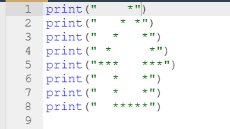
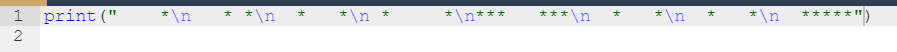
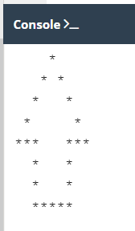
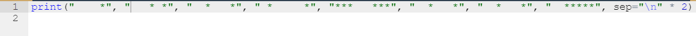
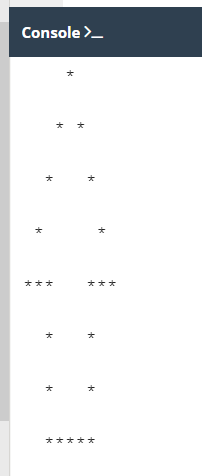
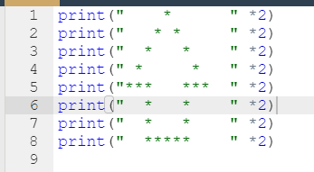
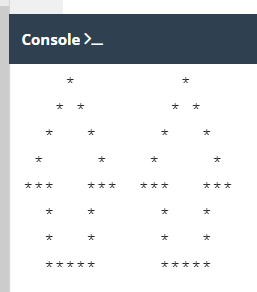

### **Python Institute PCEP Notes**

    (December 2022) - The following notes are from my studies for the PCEP certification exam on the pythoninstituture.org website.  The free study resources are available on Edube Interactive dashboard after creating a profile on edube.org.

<h1>NATURAL LANGUAGE vs. PROGRAMMING LANGUAGE</h1>
 
 

Computers have their own language called <b>machine language.</b> 

 
 

A complete set of known commands is called an <b>insteruction list</b> sometimes <b>IL</b>

 
 
<h2>What Makes a Language</h2>

Language consists of the following elements:
<ul><li>Alphabet</li>
<li>lexis</li>
<li>syntax</li>
<li>semantics</li></ul>

 
 

A program written in high0level programming language is called a <b>source code</b>. The file containing the source code is called the <b>source file</b>.

 

There are two different ways of transforming a program from a high-level programming language into machine learning, <b>COMPILATION: </b><ul>The source program is translated once.  This must be repeated each time you modify the source code.</ul><ul>The execution of the translated code is usually faster; 
 Only the user has to have theh compiler - the end-user may use the code without it;
 
The translated code is stored using machine language - it is very hard to understand it.</ul>

 

<b>INTERPRETATION:</b><ul>You can translate the source program each time it has to be run; the probram performing this kind of transformation is called an interpreter, as it interprets the code every time it is inteded to be executed; it also means that you cannot just distribute the source code as-is because the end-user also needs the interpreter to execute it.</ul><ul>you can run the code as soon as you complete it - there are no additional phases or translation;</ul><ul>the code is stored using programming language, not machine language - this means that it can be run on computers using different machine languages, you udon't compile yor code separately for each different architecture.</ul><ul>It's can't be really fast, this is a disadvantage. Also you and the end user have to have the interpreter to run your code.</ul>

 
 
<h2>FUNCTIONS</h2>
 

A function is part of the computer code:
<ul><li><b>cause some effect</b> - send text to the terminal, create a file, draw an image, play a sound, etc.</li><li><b>evaluate a value and return it as the function's result</b>; this is what makes Python functions the relatives of mathematical concepts.</li></ul>

 

What happens when Python encounters a function that needs invocation or to be invoked?<b>function_name(argument)</b> 
<ul><il>First, Python checks if the name specified is <b>legal</b>.</il> <il>Second Python checks if the function's requirements for the number of arguments allows  you to invoke the function in this way</il> <il>Third Python leaves your code for a moment and jumps into the function you want to invoke</il> <il>Fourth the function executes its code</il> <il>Finally, Python returns to your code and resumes its execution.</il><ul>

 

# The print() Function

##  The Positional way of passing the arguments
    - The common way in which passing arguments into the print() function is called the **positional way** .

# The print() function - the keyword arguments

    - Another mechanism for passing of arguments is called **keyword arguments**. 

The print() function has two keyword arguments that you can use for your purposes `end` and `sep`:
    <ul><li>end -   a keyword argument consists of three elements: a keyword (identifying the argument end here ), an equal sign = , and a value assigned to the argument</li><li>any keyword arguments have to be put after the last positional argument.</li></ul>

    - For example: 
        print("My name is", "Python.", end=" ")
        print("Month Python.")
    Console>
        My name is Python. Monty Python.
The default behaviour of the end keyword argument is used in the following way:
     end="\n"

    
**The other print() function keyword is `sep` (like separator)**
 
    - For example,
     `print("My", "name", "is", "Monty", "Python.", sep="-")` 
    **Console>**
         My-name-is-Monty-Python.
    
    The  separator keyword designated the dash - to be the separator between the strings.

Both keyword arguments may be mixed in one invocation.
    
     print("My", "name", "is", sep="_", end="*")
     print("Monty", "Python.", sep="*", end="*\n")

     The console output should look like:

         My_name_is*Monty*Python.*

* **KEYWORD TAKEAWAYS**

1. The `print()` function is a `built-in` function. It prints or outputs a specified message to the screen/console window.

2. Built-in functions, which are not user-defined functions, are always available and don't have to be imported.  Python 3.9 comes with 69 built-in functions, which can be found in alphabetical order in the `Python Standard Library`. 

3. To call a function or invoke a function, you need to use the function name followed by parenthese. You can pass arguments into a function by placing them inside the parentheses. You must separate arguments with a comma,
    `e.g., print("Hello,","World!")`
    An **empty** print() function outputs an empty line or line break to the screen.

4. Python strings are delimited with `quotes`, double quotes or single quotes.  However, whichever type opens the string has to be what is used to close the string. If a string contains quotation marks, single quotes should be used to open and close the complete string.

5. `Positional arguments` are the ones whose meaning is dictated by their position.

6. `Keyword arguments` are the ones whose meaning is not dictated by their location, but by a special work(keyword) used to identify them.

7. The **end** and **sep** paraments can be used for formatting thhe output of the **print()** function.

    `TRY IT:`
         <ul><li>minimize the number of `print()` function invocations by inserting the `\n` sequence into the strings</li>
        
     
      
     
     The print() function has been modified   
    

    
    
    This is the output.    
    
         

        <li>make the arrow twice as large (but keep the proportions</li>
         

     This is a print() function with a `sep` keyword and iterable (*2).   
    
     
    This is the output of the larger arrow.
    
     

    <li>duplicate the arrow, placing both arrows side by side</li></ul>
     
    Each print()function has been multiplied by 2 and spaces added within each string. 

    
     
    This is the output for the duplicate arrows. 
    

# Literals - The data in itself

`A literal is data whose values are determined by the literal itself.`

    For example: 123 will out put 123

However, if you input c and execute, it will not output c because c is not a literal. There are too many possible definitions or symbols that c can represent, which is why it is not a literal.

## Intergers: octal and hexadecimal numbers

There are two additional conventions in Python that are unknown to the world of mathematics.

<ul><li>The first allows us to us numbers in an <b>octal</b> representation.
  If an integer number is preceded by an <b>0O or 0o</b> (referred to as zero-o), it will be treated as an octal value.  This means that the number must contain digits taken from the [0...7] range only (0-7 is 8 digits, oct' - meaning 8).
 <b<b>0o123</b> is an <b>octal</b> number with a (decimal) value equal to <b>83</b>.

The print() function does the conversion automatically. 
Try:
 <b>print(0o123)</b> The console output should be <b>83</b>
</li>
<li>The second convention allows us to use <b>hexadecimal</b> numbers. Such numbers should be preceded by the prefix <b>0X or 0x</b>(zero-x). 
 <b>0x123</b> is a <b><u>hexadecimal</b></u> number with a (decimal) value equal to <b>291</b>. The print() function converts this automatically as well.  The print() function will look like <b>print(0x123)</b></li></ul>

### **Floats**

    

